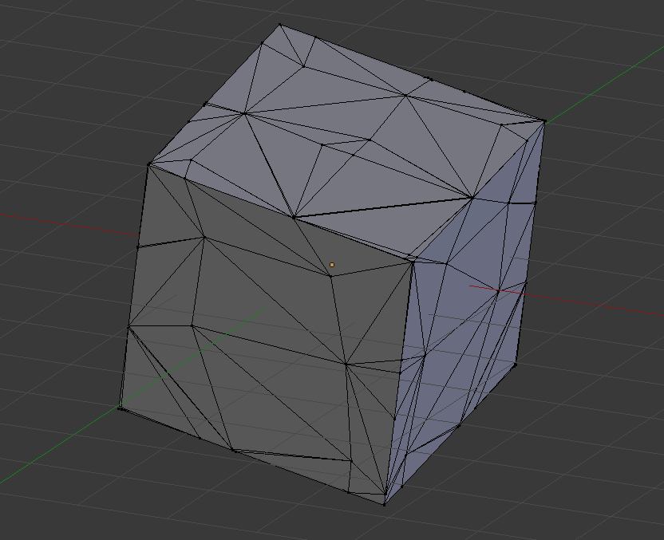

# dmc
Dual Marching Cubes Implementation in C++  
[reference](https://www.cs.rice.edu/~jwarren/papers/dmc.pdf)

## Features
- Header-only  
  `#include <dmc/dmc.hpp>`

## Requirements

### Supported Compilers
- Visual Studio 2017
- Clang (>=3.8.1)

### External Libraries
- Boost C++ Libraries (>= 1.64.0)
- Eigen (>= 3.3.3)

## License
The BSD 3-Clause License (see [LICENSE](LICENSE))
